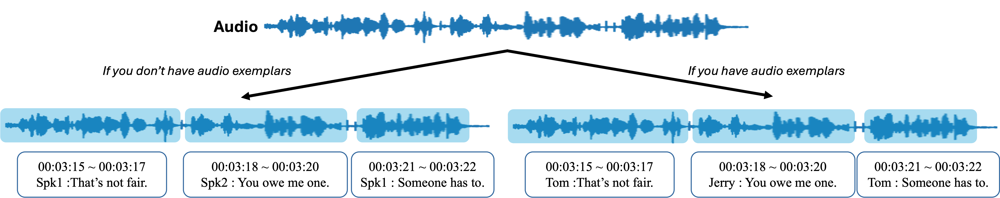

# Simple subtitling



- This code generates subtitles for TV shows or movies, including **speech transcripts with corresponding timestamps** and **speaker IDs**, from the audio file.
- The framework first runs [WhisperX](https://github.com/m-bain/whisperX) to produce speech transcripts with timestamps. Then, it extracts speaker embeddings at the sentence level. Finally, it applies Agglomerative Hierarchical Clustering (AHC) to group these embeddings and assign speaker IDs.
- If you have audio exemplars for each person (i.e., one or more speech samples per speaker), the system uses them to assign speaker names by specifying **exemplar_dir**. Otherwise, it clusters the speech segments by speaker identity.

## Installation
```
conda create -n simplesub python=3.11
conda activate simplesub
pip install -r requirements.txt
```

You also need to install ffmpeg. Please refer to [here](https://github.com/openai/whisper#setup).

## Usage

```shell
python main.py --input_file [INPUT_FILE_PATH] --output_file [OUTPUT_SRT_PATH]
# Example : python main.py --input_file data/friends.wav --output_file result/friends.srt
```

If you have audio exemplars for each cast member, you can assign exact speaker names.
First, organize the **--exemplar_dir** directory with the following structure:
```
exemplar_dir/
    spk_1/
        spk_1_1.wav
        spk_1_2.wav
        ...
    spk_2/
        spk_2_1.wav
        spk_2_2.wav
        ...
    ...
```

Then, run this command:
```shell
python main.py --input_file [INPUT_FILE_PATH] --output_file [OUTPUT_SRT_PATH] --exemplar_dir [PATH_OF_EXEMPLARS]
# Example : python main.py --input_file data/friends.wav --output_file result/friends_exemplars.srt --exemplars exemplars
```

### Some of the argparse arguments
- **input_file** : Path to the input WAV file
- **output_file** : Path to the output SRT subtitle file
- **whisper_model_type** : Type of Whisper we want to use (See [here](https://github.com/openai/whisper#available-models-and-languages)) (default : 'medium')
- **language** : The language code (two alphabet. e.g. English -> en). If None, the Whisper detect the language with the first 30 sec. (default : None)
- **embedding_model** : Speaker embedding extractor (choices : 'ecapatdnn', 'wespeaker') (default : 'wespeaker')
- **n_cluster** : Number of speakers (if known) (default : None)
- **distance_threshold** : AHC distance threshold if n_cluster == None (default : 0.8)
- **exemplar_dir** : Directory containing audio exemplars (default : None)
- **exemplar_threshold** : Cosine similarity threshold to decide "unknown" (default : 0.2)

## Results
### English
Whisper model : medium, Speaker model : Wespeaker, Distance Threshold : 0.8

https://github.com/user-attachments/assets/33780bb5-b72f-4b75-9c03-9d575d860662

### English with exemplars
Whisper model : medium, Speaker model : Wespeaker, Exemplar Threshold : 0.2

https://github.com/user-attachments/assets/56d78f6a-1817-4fb7-bea2-c622ce255268

### Korean
Whisper model : medium, Speaker model : Wespeaker, Distance Threshold : 0.75

https://github.com/user-attachments/assets/304b6c35-2a80-4d10-9785-9d0d28ee81fc

## Comments / suggestions
- Tune **distance_threshold** and **exemplar_threshold** using a validation set.
- Several excellent repositories provide speech recognition and diarization. [WhisperX](https://github.com/m-bain/whisperX) includes diarization, and tools like [Gemini](https://gemini.google.com/app) can also "transcribe the conversation and cluster by speaker" if you use the right query. **The key difference here is the assumption that each sentence is spoken by a single speaker.**
- This method cannot handle overlapping speech. However, since conversations in TV shows and movies are typically well-structured, this limitation has minimal impact in practice.

## External models / repos I used
- WhisperX : https://github.com/m-bain/whisperX
- SpeechBrain ECAPA-TDNN : https://huggingface.co/speechbrain/spkrec-ecapa-voxceleb
- Scikit-learn : https://scikit-learn.org/stable/modules/generated/sklearn.cluster.AgglomerativeClustering.html
- Wespeaker : https://github.com/wenet-e2e/wespeaker
